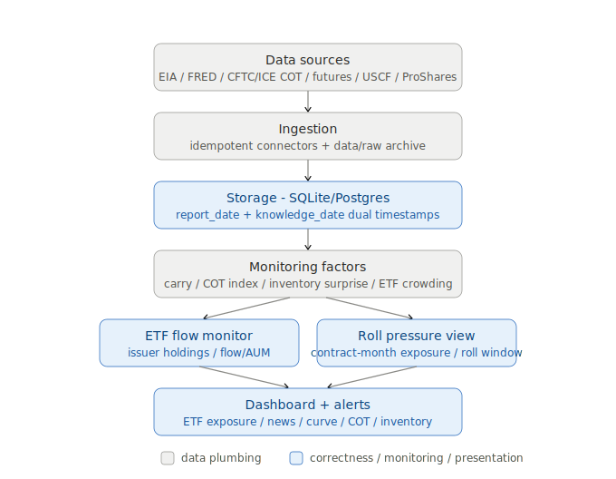

# 03 — Architecture

Chosen approach: **nightly batch + lightweight gradient-boosted models**. All inputs are
daily/weekly low-frequency data, so a single-machine nightly run matches the cadence exactly — no
streaming, no Kafka, no enterprise orchestration. Three correctness-critical pieces are grafted in
from a heavier "data-platform" design; everything else from that design is deliberately rejected
as over-engineering for a single user.



## Layers

```
free data sources
   -> idempotent connectors (per source)            [data/raw/<source>/<date>/]
   -> PostgreSQL  (report_date + knowledge_date)     [+ thin quality gate / quarantine]
   -> feature engineering                            [carry, COT index, inventory surprise, crowding]
   -> { price-direction model | roll-spread model }  [LightGBM, two heads]
   -> Streamlit dashboard + news-impact lane + rule-based alerts
```

### 1. Ingestion
- Python 3.12 + `httpx`. One idempotent connector per source implementing a common
  `fetch / validate / normalize / load` interface.
- Raw payloads saved dated to `data/raw/<source>/<date>/` before parsing (provenance + replay).
- **Graft #1 — swappable curve-provider interface:** the CME settlement scraper (the most fragile
  component) sits behind a `CurveProvider` protocol so it can be replaced by CME DataMine /
  Barchart OnDemand later without touching downstream code.

### 2. Storage
- Local Docker **PostgreSQL 16** (or Supabase / Neon free tier) via SQLAlchemy / SQLModel.
- **Graft #2 — dual timestamps:** every table carries both `report_date` and `knowledge_date`.
  This is what stops the backtest from lying.
- **Graft #3 — thin quality gate:** lightweight `pydantic` assertions (NOT Great Expectations) —
  freshness checks against the release calendar (EIA Wed/Thu, COT Fri), range/plausibility checks
  (no negative OI, no >50% day-over-day AUM jump, no COT date gaps). Failures get a `quarantine`
  flag so bad batches never silently enter feature builds.
- The initial implementation stores `knowledge_date` as UTC-naive at the database boundary so
  SQLite tests and Postgres deployments use one comparable representation of first-known time.
- Parquet files in `data/processed/` read via DuckDB are the analytical cache so backtests never
  hit the live DB.

### 3. Feature engineering
- pandas / polars + DuckDB, run nightly after ingestion. ~15–25 features per commodity per day,
  all publication-lag-adjusted. See [05-prediction-methodology.md](05-prediction-methodology.md).
- The initial WTI feature builder writes `daily_feature_rows` from an explicit decision timestamp
  and now includes curve spreads/curvature, front-month returns, carry changes, COT
  net/z-score/index, seasonal inventory surprise, macro levels, USO crowding, and roll-window
  interaction features.
- `export-wti-feature-cache` writes persisted feature rows to Parquet in `data/processed/`, using
  DuckDB as the local cache writer/reader for modeling and backtests.

### 4. Modeling
- Two heads: `price_direction` and `spread_direction`, behind one `PredictionModel` interface
  (`predict` + `raw_contributions`). Two backends implement it: a hand-rolled logistic baseline
  (always available) and **LightGBM** (optional `gbm` extra). A dispatching `load_artifact` reads
  each saved artifact's `model_type` and lazily imports LightGBM only when needed, so the core
  install never requires the native dependency.
- Pooled cross-commodity training (commodity-id as a categorical) to fight thin sample size.
- Expanding-window walk-forward, monthly retrain, evaluated across the 2008 / 2014–16 / 2020 /
  2021–22 regimes.
- The first implementation slice reads the Parquet feature cache, builds forward price/spread
  direction targets, and evaluates naive-persistence plus lightweight logistic baselines with
  expanding walk-forward windows. It can also persist the current logistic baseline as a JSON model
  artifact for daily inference.
- **Purged walk-forward (look-ahead fix):** each example carries `target_report_date` (the date
  its label becomes known, horizon trading days ahead). The walk-forward trainer purges any
  training example whose `target_report_date >= the decision date`, so labels that were not yet
  realized never leak into training (this also fixes the naive-persistence baseline). A regression
  test locks the embargo.

### 5. Inference
- `predict-daily` loads the latest point-in-time feature row (`knowledge_date <= as_of`), scores it
  with the price and spread logistic artifacts, and writes a row to the `daily_predictions` table:
  `price_up_probability`, `spread_up_probability`, a naive-persistence reference for each head,
  both `*_model_version` stamps, and `*_top_drivers` (the linear log-odds contributions
  `weight * value / scale` ranked by magnitude — an exact local explanation for the logistic
  model, no SHAP dependency). The command refuses to predict when `predicted_at` precedes the
  feature row's `knowledge_date`, and refuses mismatched/ swapped model heads.

### 6. Orchestration
- macOS `launchd` plist (or a single local Prefect agent if you want retries/UI) running one bash
  script: `ingest -> quality gate -> build_features -> (monthly) retrain -> predict_daily`.
  Logs to file. **Explicitly not Airflow / Dagster.**

### 7. Dashboard + alerts
- **Streamlit** (`dashboard` extra), reading the repository directly. Implemented sections: Today's
  Call (per-head probability vs naive + driver tables), Price & Curve, Positioning (COT), Inventory,
  and **Model Health** (model-vs-naive accuracy/Brier, overall, rolling, and per regime). Data
  shaping is a pure, unit-tested layer (`dashboard/data.py`); `app.py` is thin glue. The Latest
  Market-Moving News lane (Phase 7) is not built yet.
- The Phase 7 news-impact lane shows latest energy-futures-moving headlines with affected
  commodity, catalyst type, importance, impact direction, confidence, short rationale, and source
  link. Article-level labels are display/alerting data first; only aggregated point-in-time news
  features graduate into models after walk-forward validation.
- Alerts via free Slack webhook or `ntfy.sh`: pipeline failure, the `USO`-2020 crowding alert
  (AUM/OI above threshold), and the T-10 roll-window-approach notice — all rule-based, independent
  of model output.

## Recommended stack (summary)

| Concern | Choice |
|---|---|
| Ingestion | Python 3.12 + httpx, per-source connectors, swappable `CurveProvider` |
| Storage | PostgreSQL 16 (Docker / Supabase / Neon free tier), dual timestamps, pydantic quality gate |
| Analytical cache | Parquet + DuckDB |
| Orchestration | launchd plist (or local Prefect agent) |
| Modeling | LightGBM (2 heads) + scikit-learn baseline; MLflow file-store later |
| Dashboard | Streamlit + Plotly (Streamlit Community Cloud optional) |
| Alerting | Slack webhook / ntfy.sh |

## Explicitly out of scope (rejected as over-engineering for one user)

Dagster, dbt, Great Expectations, TimescaleDB hypertables, Grafana, FastAPI serving layer, and a
European UCITS ETC ingestion layer. Data volume is thousands of rows/day — none of that
infrastructure is justified, and the predictive edge lives in the data/signals, not the
orchestrator. Chemicals (PP/PVC/methanol/ethylene/PTA) are out of scope permanently — no Western
ETF wrapper exists.
